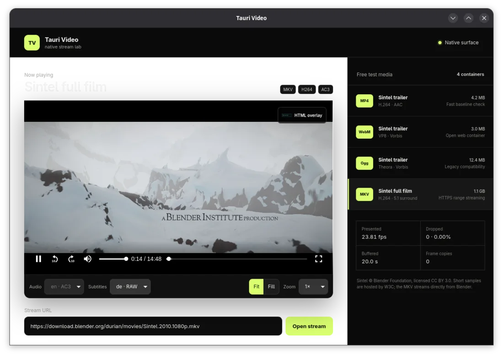
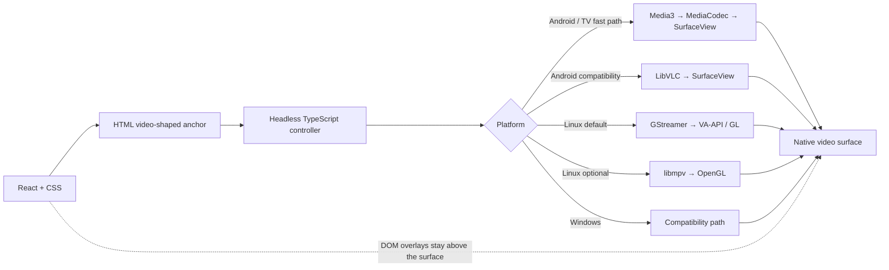
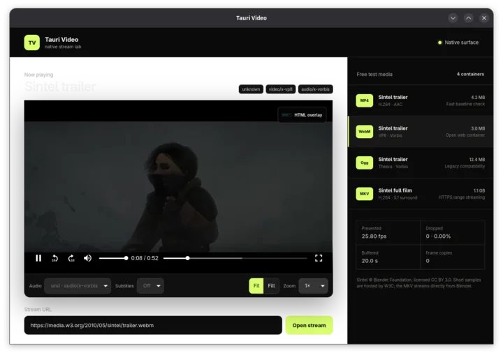
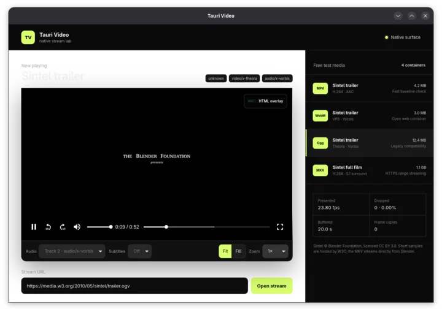

<div align="center">

# tauri-plugin-video

**Native video frames. React controls. Normal HTML overlays.**

[](https://github.com/vynxc/tauri-video-plugin/actions/workflows/test.yml)
[](https://github.com/vynxc/tauri-video-plugin/actions/workflows/audit.yml)
[](https://v2.tauri.app/)
[](https://react.dev/)
[](#license)

Developer preview for **Linux · Android · Android TV**. Windows qualification is next.

</div>



The WebView handles layout and controls. Media3/MediaCodec, LibVLC, or GStreamer decodes and presents the video on a native surface underneath it. No canvas frame pump, no full-file download, and no mandatory pre-conversion.

## What works

| Playback | UI and API | Performance |
| --- | --- | --- |
| Remote MKV, MP4, WebM, Ogg, AVI, MPEG-TS, and more | Headless TypeScript API | Native hardware decode where available |
| HTTP(S) range streaming and seeking | Optional React player | Zero decoded-frame copies on the native path |
| Audio, subtitle, and video tracks | CSS sizing, fit, fill, and zoom | Bounded encoded-data buffering |
| Large files start before the download finishes | Media Chrome example controls | FPS and dropped-frame telemetry |



## Install

The npm and crates.io packages are not published yet. After the first release:

```sh
npm install tauri-plugin-video-api
cargo add tauri-plugin-video
```

GStreamer remains the Linux default. To compile the optional libmpv backend,
install your distribution's libmpv development package and enable the feature:

```toml
tauri-plugin-video = { version = "0.1", features = ["mpv-runtime"] }
```

Register the Rust plugin and add `video:default` to your Tauri capability:

```rust
tauri::Builder::default()
    .plugin(tauri_plugin_video::init())
    .run(tauri::generate_context!())?;
```

## Headed React player

```tsx
import { VideoPlayer } from "tauri-plugin-video-api/react";
import "tauri-plugin-video-api/react/styles.css";

export function Player({ url }: { url: string }) {
  return (
    <VideoPlayer source={url} autoPlay>
      
    </VideoPlayer>
  );
}
```

Size and position it with ordinary CSS. Children are ordinary DOM and render above the native video.

On Linux the controller automatically drills and tracks the native-video hole while keeping the rest of the transparent Tauri window opaque; no special wrapper structure or backdrop CSS is required. See [Linux setup](docs/linux.md#opaque-application-background-with-a-transparent-video-hole).

## Headless API

Bring your own React controls, another component system, or no UI at all:

```ts
import { attachVideo } from "tauri-plugin-video-api/headless";

const anchor = document.querySelector("video")!;
const player = await attachVideo(anchor, {
  source: movieUrl,
  backend: "auto", // or "mpv", "gstreamer", "libvlc", "media3"
});

await player.play();
await player.seek(60);
await player.selectTrack("audio", audioTrackId);
console.log(player.bufferedAhead(), player.playbackQuality());
```

The native path mirrors `currentTime`, `duration`, `buffered`, play, pause, seek, volume, and standard media events onto the anchor element, so established HTML media-control libraries can drive it.

## Example media lab

The example uses [Media Chrome](https://github.com/muxinc/media-chrome) controls and four freely licensed Sintel sources. It is a real player, not a static showcase.

<table>
  <tr>
    <td></td>
    <td></td>
  </tr>
  <tr>
    <td align="center"><strong>WebM · VP8 / Vorbis</strong></td>
    <td align="center"><strong>Ogg · Theora / Vorbis</strong></td>
  </tr>
</table>

| Source | Container | Purpose |
| --- | --- | --- |
| [Sintel trailer](https://media.w3.org/2010/05/sintel/trailer.mp4) | MP4 | Fast baseline |
| [Sintel trailer](https://media.w3.org/2010/05/sintel/trailer.webm) | WebM | Open web codecs |
| [Sintel trailer](https://media.w3.org/2010/05/sintel/trailer.ogv) | Ogg | Legacy compatibility |
| [Sintel full film](https://download.blender.org/durian/movies/Sintel.2010.1080p.mkv) | MKV · 1.1 GB | HTTPS ranges, 5.1 audio, 10 subtitle tracks |

```sh
cd examples/tauri-app
npm install
npm run tauri dev
```

The local Linux capture held the 24 fps source rate with zero dropped frames for all four sources. Treat that as qualification evidence for this machine, not a universal benchmark.

## Platform status

| Platform | Native path | Status |
| --- | --- | --- |
| Android / Android TV | Media3/MediaCodec default; selectable LibVLC → `SurfaceView` | Working; 20-format emulator matrix |
| Linux | GStreamer default; optional libmpv → GTK OpenGL | Working |
| Windows | Compatibility pipeline | Native D3D11 presentation remains |

See the [API documentation](docs/api.md), [Linux setup](docs/linux.md), [Android setup](docs/android.md), and [qualification report](qualification/REPORT.md).

Sintel © Blender Foundation, [CC BY 3.0](https://download.blender.org/durian/movies/). Media Chrome is MIT licensed.

## License

MIT or Apache-2.0, at your option.
